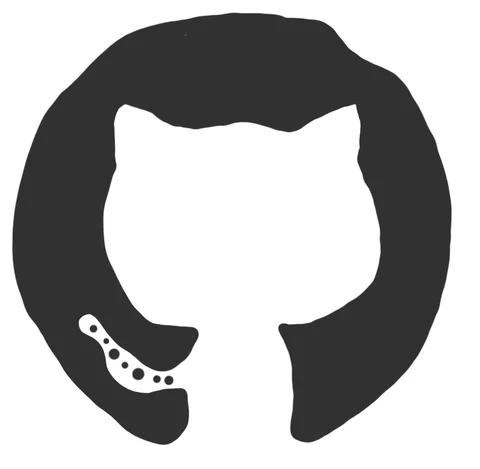
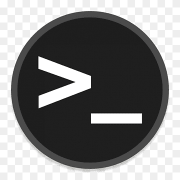

<!-- 0000 -------------------------------------------------- -->
<!-- ### 🏃🏻‍♂️🎓👨🏻‍💻👨🏼‍🎤👨🏽‍🎤⛸️🏹⛸️🏂🎯♟️🥁🏆🥇🎖️🏅🤺🤿🐦🦅🐙🕷️🐍🕸️🐢🦑🐊🐎🐳🐋🦈🐰 ⚡ ✨🎯⏱️🦅⚡💥🔥❄️ Full Stack Web Developer -->
<!-- 

 -->
<!--  -->
<!-- --- -->
<!-- 0009 -------------------------------------------------- -->
<!-- 
 
  
<b>✨ VISITOR COUNT ✨</b>

  

 -->

<!-- 0001 -------------------------------------------------- -->
# Hi There 👋, I'm AbdelRahman Khalaf 
<!-- <h1>Hi There, I'm AbdelRahman Khalaf </h1> -->

<!-- 0002 -------------------------------------------------- -->
<!-- ### A passionate 🔥 Full Stack Web Developer 🔥 from Egypt -->
<!-- ##  About Me : -->
Hi, I'm a **🔥 Full Stack Web Developer 🔥** Who loves building digital products. Passionate about designing high-performance responsive websites. I have built many digital products using many things like Sass and Pug, React, Redux, Node.js, and Database. I specialize mostly in JS but I also write PHP, Java, Python, and some other things.

<!-- 0003 -------------------------------------------------- -->

  <!--    -->
  
  

  <!--  -->

  

  |🔭 I’m currently working on **A JavaScript Tutorial Reference** (Allarm Tutorials)|📫 How to reach me **egybaron5@gmail.com**| 
  |:--|:--|
  | 👯 I’m looking to collaborate on **Open Source Projects** | 👨‍💻 Most of my projects are available at [Github](https://github.com/Alexander-Sands) & [Codepen](https://codepen.io/alexander-sands)| 
  | 🤝 I’m looking for help with **teaching new technology**|📄 Know about my experiences [Linkedin](https://www.linkedin.com/in/abdul-rahman-khalaf-b76307133/) & [Resume](https://www.linkedin.com/in/abdul-rahman-khalaf-b76307133/)|
  | 🌱 I’m currently learning **Node.js** | ⚡ Fun fact **I love Parkpur & Freerunning**|
  | 💬 Ask me about **JavaScript**
    
<!-- - 📝 I regularly write articles on -->

<!-- 0004 -------------------------------------------------- -->
---
##  My Github Stats:

  
  <!--  -->

  <!--  -->

  <!--  -->

  | |  |
  |:--:|:--:|

<!--START_SECTION:waka-->

<!--END_SECTION:waka-->

<!-- ⏳ **Year Progress** { █████████████████▁▁▁▁▁▁▁▁▁▁▁▁▁ } 57.55 % as on ⏰ 29-Jul-2023 -->

---

<!-- 0005 -------------------------------------------------- -->
<!-- ### Languages and Tools -->
## Skill Set :muscle:

These are some of the major technologies that I use or have worked on in the past:

**Programming Languages**|||||||
|--|:--:|:--:|:--:|:--:|:--:|:--:|
**Libraries and Frameworks**||||||
**Databases**||
**Design**||||
**Task Runners**||
**Tools**|||||
|||||||

<!-- JSON -->
<!--  Command Line -->
<!-- Ajax -->
<!--  -->
<!--  -->
<!--  -->
<!--  -->

---

<!-- 0006 -------------------------------------------------- -->

<!--  -->

## 🗂️ Highlight Projects

  

  

  

  

  

<!-- 0007 -------------------------------------------------- -->
## Portfolios
Portfolios |  |  
|--|--|--| 

<!-- 0008 -------------------------------------------------- -->
## Let's Connect :handshake:
|<a href="https://www.facebook.com/alexander.sands.7/" target="blank">
|--|--|
<!--  -->