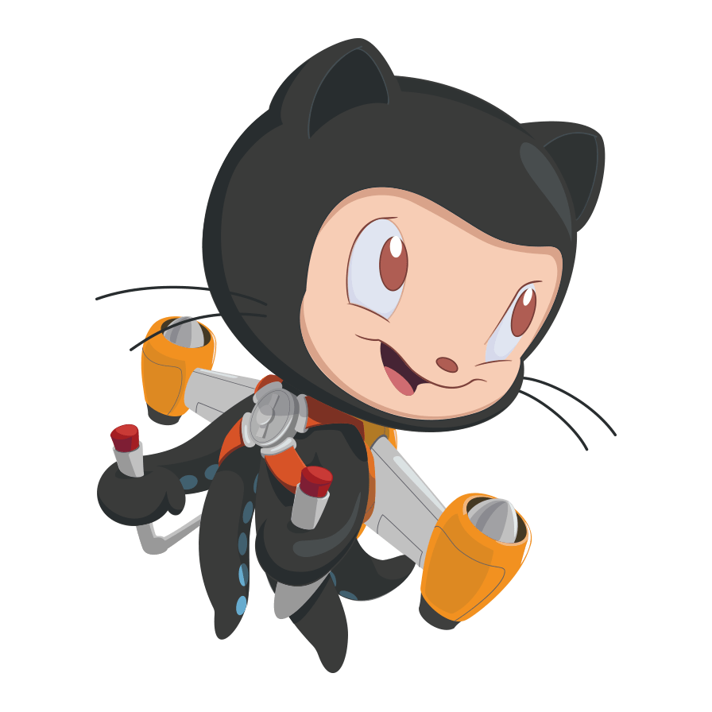

# Hi 👋 I'm AbdelRahman Khalaf

### Full Stack JavaScript Developer

Building modern web applications, interactive systems, and AI-assisted software solutions.

- 🌍 Based in Egypt
- 💻 Full Stack JavaScript Developer
- 🚀 React • Node.js • Express • MongoDB
- 🤖 Exploring AI-Assisted Development
- 🎨 Interested in Creative Coding & Interactive Visual Systems

---

## 👨‍💻 About Me

I am a Full Stack JavaScript Developer with a background in Management Information Systems.

My focus is building scalable web applications using modern JavaScript technologies while continuously improving software architecture, problem-solving skills, and development workflows.

I enjoy combining engineering principles with creativity through interactive web experiences, simulations, and visual systems.

---

## 🎯 Current Focus

- Building production-ready Full Stack applications
- Advanced React and modern frontend architecture
- Backend development with Node.js and Express
- Database design and API development
- AI-assisted development workflows
- Software engineering best practices
  
---

<!-- ## 🛠 ⚙️ Tech Stack -->
## 🛠️ Tech Stack

### Front-End

<!--  -->

### Back-End

### Databases

### Tools

<!--  -->

<!-- ---

## 🚀 Featured Projects

### Project Name 1

Short description.

**Tech:** React • Redux Toolkit • Node.js • MongoDB

**Features:**

- Authentication
- REST API
- Responsive UI
- State Management

**Repository :**
🔗 https://codepen.io/alexander-sands/full/azBvWbV

---

### Project Name 2

Short description.

**Tech:** React • Redux Toolkit • Node.js • MongoDB

**Features:**

- Authentication
- REST API
- Responsive UI
- State Management

**Repository :**
🔗 https://codepen.io/alexander-sands/full/azBvWbV

---

### Project Name 3

Short description.

**Tech:** React • Redux Toolkit • Node.js • MongoDB

**Features:**

- Authentication
- REST API
- Responsive UI
- State Management

**Repository :**
🔗 https://codepen.io/alexander-sands/full/azBvWbV -->

<!-- ---

## ⚛️ React & Frontend Projects -->

---

## 🎨 Creative Coding Projects

### Blue Serpent – Perlin Noise Animation

Generative particle animation driven by procedural noise algorithms.

**Tech:** JavaScript, HTML5 Canvas, Perlin Noise

🔗 https://codepen.io/alexander-sands/full/azBvWbV

### Elastic Collision Particle Simulation

Physics-based collision system using vector mathematics and object-oriented JavaScript.

**Tech:** JavaScript, Canvas, Physics Simulation

🔗 https://codepen.io/alexander-sands/full/raMQgvP

### Neon Vortex Bloom

Developed an interactive generative art system using HTML5 Canvas and JavaScript.

**Tech:** JavaScript, Canvas

🔗 https://codepen.io/alexander-sands/full/emBBdpe

### Interactive Space Particles Explosion 

Developed an interactive particle system using HTML5 Canvas and JavaScript.

**Tech:** JavaScript, Canvas

🔗 https://codepen.io/alexander-sands/full/YPGYdMB

---

<!-- ## 📈 GitHub Stats -->
## 📈 GitHub Activity

  <!--  -->

  <!-- 
  theme=dark
  theme=radical
  theme=tokyonight
  theme=github-dark
  theme=dracula 
  -->

  <!-- 
  
  
  
   -->

  <picture>
    <source
      srcset="https://github-readme-streak-stats.herokuapp.com/?user=Alexander-Sands&theme=tokyonight"
      media="(prefers-color-scheme: dark)"
    />
    <source
      srcset="https://github-readme-streak-stats.herokuapp.com/?user=Alexander-Sands"
      media="(prefers-color-scheme: light)"
    />
    
  </picture>

  

  <!--  -->
  <!--  -->

  

  
---

## 💼 Open To

- Full Stack Developer Roles
- Frontend Developer Roles
- JavaScript Development
- Open Source Collaboration
- Freelance Opportunities

---

## 📫 Contact

  
  
  
  

---

#### Thanks for visiting my profile. ❤️ 

